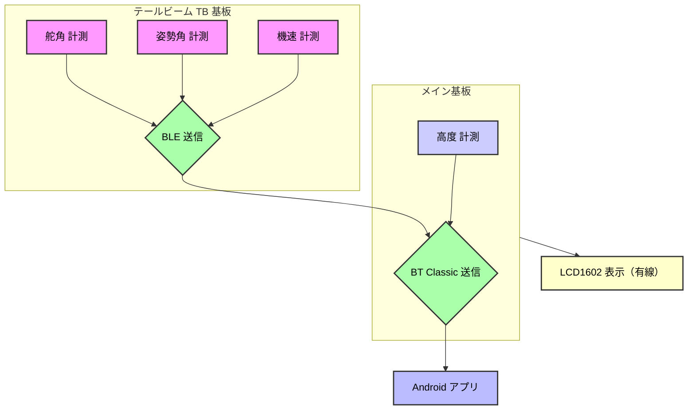
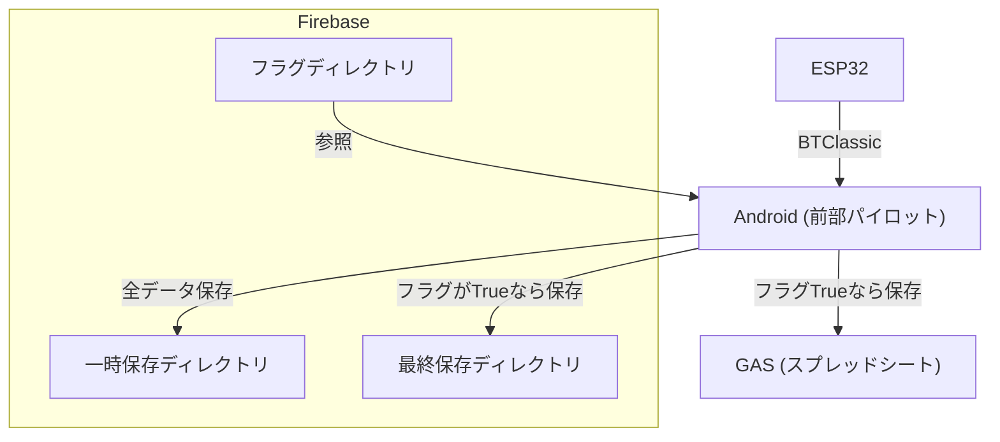
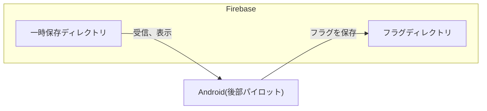

# 製作概要

TeamBirdmanTrial（**TBT**）S310 電装設計の [norahshion](https://github.com/norahshion) です。  
本リポジトリは、S310 電装班で製作したシステムの一般公開用です。  

本システムでは **ESP32** をメイン基板に採用し、テールビーム基板との **BLE通信**、および **Android端末とのBT Classic通信** を用いて、各種データの計測・表示・保存を行います。

---

### 主な使用技術

| 技術 | 用途 |
|------|------|
|  | ファームウェア開発 |
|  | Androidアプリ開発 |
|  | アプリ言語 |
|  | クラウドデータ保存 |

---

### 計測機器

| 計測項目 | センサー | 通信方式 | 設置場所 | 備考 |
|----------|----------|----------|----------|------|
| 高度 | [MB1242-000](https://akizukidenshi.com/catalog/g/g114709/) | I2C | メイン基板 | 測定範囲 20cm〜765cm |
| 機速 | [ピトー管](https://amzn.asia/d/ecEdyK8) + [SDP810-500Pa](https://www.mouser.jp/ProductDetail/Sensirion/SDP810-500PA) | I2C | テールビーム | 差圧方式 |
| 姿勢角 | [BNO080](https://www.amazon.co.jp/dp/B0DM98Q67M) | I2C | テールビーム | 9軸センサ |
| 舵角 | [CJMCU-103](https://amzn.asia/d/fbYAGlM) | アナログ | TB ER部 | 角度検出 |

---

### システム概要

### 全体構成図（ESP32 ⇔ Android）

---
### Androidアプリ  
前部パイロット用

後部パイロット用

---
# ESP32 実装・配置
- メイン基板：コックピット下部
- TB基板：ER付近  

基板製作、マイコン主担当：[tttt10231023](https://github.com/tttt10231023)  

|コックピット内機器設置場所|
|---|
||

 実際の設置場所
| | |
|---|---|
|メイン基板||
|TB基板||

 基盤と基板BOX
| |メイン基板|TB基板|
|---|---|---|
|基板|||
|基板BOX|||

