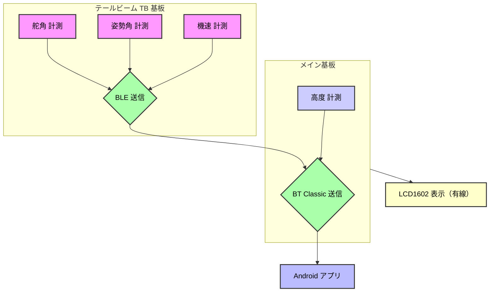
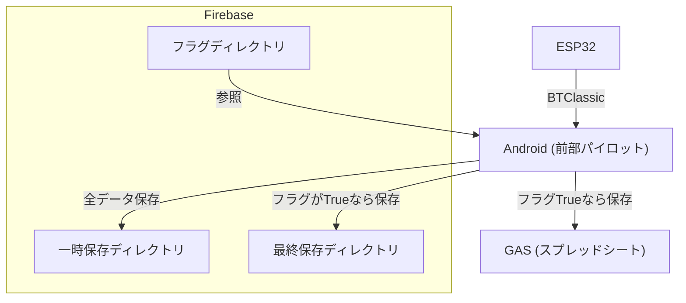
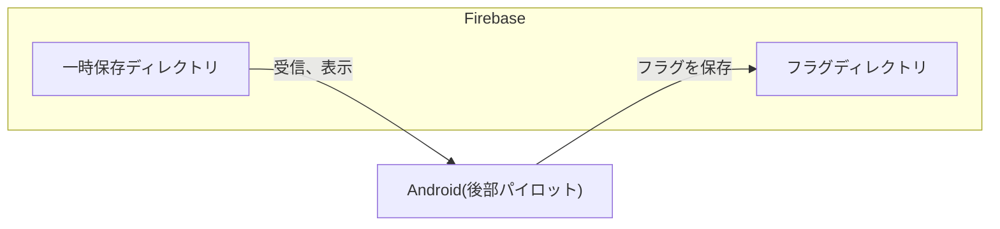

## 📄 目次

- [1. 設計思想と目標](#1-設計思想と目標)
- [2. 全体構成図（ESP32 ⇔ Android）](#2-全体構成図esp32--android)
- [3. 通信アーキテクチャとプロトコル](#3-通信アーキテクチャとプロトコル)
- [4. アプリケーションアーキテクチャ](#4-アプリケーションアーキテクチャ)
    - [4.1. Androidアプリ構造図（データフロー）](#41-androidアプリ構造図データフロー)
    - [4.2. Androidアーキテクチャ詳細（技術選定）](#42-androidアーキテクチャ詳細技術選定)
- [5. 設計上の課題と解決策](#5-設計上の課題と解決策)

# 1. 設計思想と目標

# 全体構成図（ESP32 ⇔ Android）

---
### Androidアプリ構造図
前部パイロット用

後部パイロット用

---
# Androidアーキテクチャ
|記述方法|
|---|
|MVVM|
|Jetpack Compose|

|使用バージョン|  |
|---|---|
|Android Gradle Plugin|8.4.1|
|Kotlin Gradle Plugin|2.2.0|
|Google Services Plugin|4.4.2|
|Kotlin Language/API|2.2.0|
|Compose BOM|2024.09.00|
|Core KTX|1.16.0|
|Lifecycle Runtime KTX|2.9.0|
|Activity Compose|1.10.1|
|ConstraintLayout|2.2.1|
※その他詳細なバージョンについては、`libs.versions.toml`及び`build.gradle`を参照ください。

