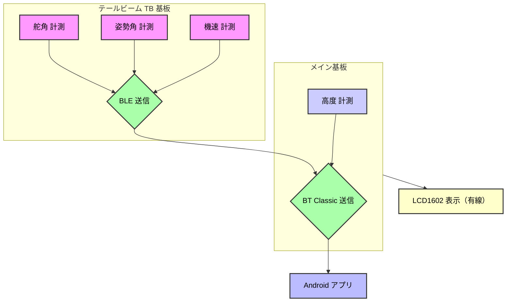
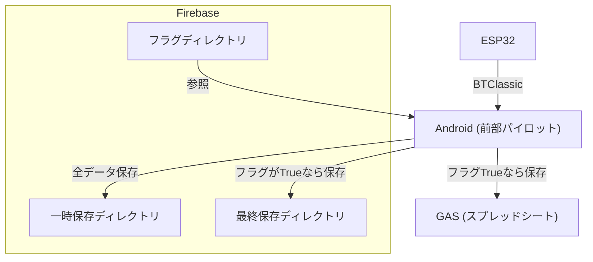
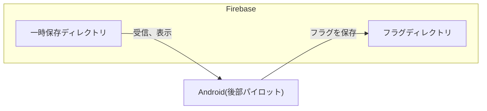

# ⚙️ 全体構成図、システムアーキテクチャ

本章では、S310 フライトデータ計測システムの中核を成す、ESP32 組込みシステムと Android アプリケーションの全体的な構成、通信アーキテクチャ、そしてアプリケーション内部の設計思想（アーキテクチャ）について詳細に解説する。  
特に、昨年度の課題を克服し、リアルタイム性と堅牢性を両立させるために導入した技術的なアプローチと設計原則に焦点を当てた。

## 📄 目次

- [⚙️ 全体構成図、システムアーキテクチャ](#️-全体構成図システムアーキテクチャ)
  - [📄 目次](#-目次)
  - [1. 設計思想と目標](#1-設計思想と目標)
  - [2. 全体構成図（ESP32 ⇔ Android）](#2-全体構成図esp32--android)
  - [3. 通信アーキテクチャとプロトコル](#3-通信アーキテクチャとプロトコル)
  - [4. アプリケーションアーキテクチャ](#4-アプリケーションアーキテクチャ)
    - [前部パイロット用アプリ](#前部パイロット用アプリ)
    - [後部パイロット用アプリ](#後部パイロット用アプリ)
- [4.1. Android アプリ構造図（データフロー）](#41-android-アプリ構造図データフロー)
    - [前部パイロット用](#前部パイロット用)
    - [後部パイロット用](#後部パイロット用)
- [4.2. Android アーキテクチャ詳細（技術選定）](#42-android-アーキテクチャ詳細技術選定)
- [5. 設計上の課題と解決策](#5-設計上の課題と解決策)

## 1. 設計思想と目標

本システムは、飛行中の計測データ（機速・姿勢角・舵角・高度）をリアルタイムに取得・共有・蓄積することを目的として設計した。  
S300 で発生した有線断線トラブルを解消するため、S310 では BLE 通信を導入し、配線点数を大幅に削減した。  
また、複雑化しやすいアプリケーションの構造を MVVM（Model-View-ViewModel）へ再設計することで、モジュール単位での機能拡張性、保守性、そして開発者の引継ぎの容易性を確保した。<br><br>

| 設計方針                                                                                     |
| -------------------------------------------------------------------------------------------- |
| 信頼性重視：通信途絶時の再接続機構、バックグラウンドでの処理の持続                           |
| リアルタイム性：UI 更新と通信処理を非同期で分離                                              |
| 拡張性：モジュール単位のアーキテクチャ設計により、新規機能を追加可能                         |
| 再利用性：ViewModel 層を中心にデータ処理を統一化し、将来の他プロジェクトでも流用しやすい設計 |

<br>昨年(S300)システムとの大きな変更点として以下の要素が挙げられる。

S300 では有線配線の断線トラブルが複数発生した。  
これを受け、S310 では BLE 通信を採用し、配線点数の最小化を図った。  
S300 はコックピットからテールビーム(TB)まで有線で配線していた。  
これは、従来の機体で採用していたフライ・バイ・ワイヤー操舵方式がルール上有線接続を義務付けていたためである。  
しかし S300 はワイヤーリンゲージ方式を採用したため、有線で配線する必要性がなくなった。  
そのため、トラブルが起きたこの配線を BLE 通信とすることで、不具合要因の削減を行った。

次に、アプリ開発のアーキテクチャに MVVM を採用した。  
前年度アプリでは構造の可視性が低く、機能間の依存関係が複雑で引き継ぎが困難であったため、モジュールごとに機能を分割することで引継ぎの容易性や機能拡張性を保証するためである。  
また、UI を xml 形式から JetpackCompose 形式に変更した。  
XML ベースの UI 定義では状態管理やデータバインディングとの整合性が複雑化していたため、宣言的 UI である Jetpack Compose へ移行した。  
これにより、ViewModel との連携や動的 UI 更新が容易となり、開発効率が向上した。  
以下に前年度と今年度の UI の比較画像を示す。

<!--展開に違和感、突然すぎるかも-->

| 昨年(S300)                                                                                                                         | 今年(S310)                                                                                                                         |
| ---------------------------------------------------------------------------------------------------------------------------------- | ---------------------------------------------------------------------------------------------------------------------------------- |
|  |  |

昨年は単純な数字のみの表示だったが、今年は高度に応じて色が変化するバーと、姿勢角によって回転する機体モデルをアプリ内に実装し、より**視覚的にわかりやすい**アプリを目指して製作した。

<!--アプリの動作、操作手順説明のmarkdownもあったほうがいい？-->

次に、データの保存方法を Google スプレッドシート単体だったものから、Firebase RealtimeDatabase にも二十保存する方式に変更した。  
Google Apps Script (GAS) の定期実行トリガは最短でも 1 分間隔であり、リアルタイムデータ反映には不向きであった。  
そのため、S300 は後部パイロットしかアプリのログを確認不可能だった。  
そこで、Firebase RealtimeDatabase を利用することで、両パイロットへのデータの共有が可能になった。  
また、外部へのアプリケーション公開の可能性を考え、Firebase の認証方法をメールアドレス認証に設定、アプリからの認証アドレス追加時の確認を Firebase Functions を用いて実装した。

## 2. 全体構成図（ESP32 ⇔ Android）



図に示すように、TB 基板では姿勢角・舵角・機速を BLE で統合し、メイン基板を介して Bluetooth Classic により Android へ送信する。

## 3. 通信アーキテクチャとプロトコル

| 通信区分     | 使用規格          | 役割                 | 通信周期   | 備考                   |
| ------------ | ----------------- | -------------------- | ---------- | ---------------------- |
| センサー通信 | BLE               | TB 基板 → メイン基板 | 100 ms     | 機速・姿勢・舵角を送信 |
| メイン通信   | Bluetooth Classic | メイン基板 → Android | 100 ms     | 統合データ送信         |
| Firebase     | HTTPS             | Android → クラウド   | 条件判定時 | 共有・蓄積             |

各計測系デバイスのデータはメイン基板で統合され、Bluetooth Classic を介して Android アプリへ送信される。  
前部パイロット用アプリでは受信データを一時保存後、特定条件（フラグ検知）で Firebase および GAS に転送する設計とした。

## 4. アプリケーションアーキテクチャ

### 前部パイロット用アプリ

ディレクトリ構造を以下に示す。

```plaintext
backP/
├─ app/
│   └─ src/
│       ├─ main/
│       │   └─ java/
│       │       ├─ com/example/backP/
│       │       │   ├─ dataclass/
│       │       │   │   └─ FlightData.kt
│       │       │   ├─ model/
│       │       │   │   └─ 各model
│       │       │   ├─
│       │       │   ├─ navigation/
│       │       │   │   └─ NavigationGraph.kt
│       │       │   ├─ screens/
│       │       │   │   ├─ 各Screenファイル
│       │       │   │   └─ views/
│       │       │   │       └─ 各UIファイル
│       │       │   ├─ ui.theme/
│       │       │   │   └─ テーマ設定ファイル
│       │       │   ├─ viewmodel/
│       │       │   │   └─ 各viewmodel
│       │       │   └─ MainActivity.kt
│       │       ├─ AndroidManifest.xml
│       │       └─ アイコン画像
│       ├─ build.gradle.kts
│       ├─ google-service.json
│       └─ script.js
├─ gradle/
│   └─ libs.versions.toml
├─ build.gradle.kts
└─ settings.gradle.kts
```

各主要ディレクトリの役割は以下のとおりである。
| パス | 説明 |
| ---------------------- | ---------------------- |
| `dataclass/` | データクラス |
| `model/` | Bluetooth に必要な処理ファイル |
| `navigation/` | アプリ内画面遷移（NavHost 定義など） |
| `screens/` | 各画面（Composable 単位）のロジック |
| `screens/views/` | UI 部品や再利用可能な Composable 群 |
| `ui/theme/` | カラー・タイポグラフィ設定 |
| `viewmodel/` | 状態管理（ViewModel）群 |
| `MainActivity.kt` | アプリのエントリーポイント |
| `res/` | 画像・レイアウト・アイコンなどのリソース |
| `google-services.json` | Firebase 関連の設定 |
| `libs.versions.toml` | 依存関係バージョン管理ファイル |

---

### 後部パイロット用アプリ

ディレクトリ構造を以下に示す。

```plaintext
backP/
├─ app/
│   └─ src/
│       ├─ main/
│       │   ├─ java/
│       │   │   └─ com/example/backP/
│       │   │       ├─ navigation/
│       │   │       │   └─ NavigationGraph.kt
│       │   │       ├─ screens/
│       │   │       │   ├─ 各Screenファイル
│       │   │       │   └─ views/
│       │   │       │       └─ 各UIファイル
│       │   │       ├─ ui/theme/
│       │   │       ├─ viewmodel/
│       │   │       │   └─ 各ViewModelファイル
│       │   │       └─ MainActivity.kt
│       │   ├─ AndroidManifest.xml
│       │   └─ res/
│       ├─ build.gradle.kts
│       ├─ google-services.json
│       └─ script.js
├─ gradle/
│   └─ libs.versions.toml
├─ build.gradle.kts
└─ settings.gradle.kts
```

各主要ディレクトリの役割は以下のとおりである。
| パス | 説明 |
| ---------------------- | ---------------------- |
| `navigation/` | アプリ内画面遷移（NavHost 定義など） |
| `screens/` | 各画面（Composable 単位）のロジック |
| `screens/views/` | UI 部品や再利用可能な Composable 群 |
| `ui/theme/` | カラー・タイポグラフィ設定 |
| `viewmodel/` | 状態管理（ViewModel）群 |
| `MainActivity.kt` | アプリのエントリーポイント |
| `res/` | 画像・レイアウト・アイコンなどのリソース |
| `google-services.json` | Firebase 関連の設定 |
| `libs.versions.toml` | 依存関係バージョン管理ファイル |

この構成は MVVM アーキテクチャに基づいており、UI 層（screens/views）とロジック層（viewmodel）を明確に分離している。  
これにより、UI 更新の非同期化の実施が容易となった。

図示した通り、MVVM をもとにして製作したシングルモジュール構造のアプリケーションである。  
gradle は Kotlin Script にて記述。  
UI は JetpackCompose 使用。

<!--分ける必要ある？-->

# 4.1. Android アプリ構造図（データフロー）

### 前部パイロット用



前部パイロット用アプリは、常時 ESP32 との通信を行い、値の更新があるたびに Firebase RealtimeDatabase の一時保存ディレクトリにデータを保存する。  
このディレクトリ内のデータは 20 個以内となるように、適宜削除している。  
Firebase RealtimeDatabase のフラグ保存ディレクトリの値が True となったら、Firebase RealtimeDatabase 最終保存ディレクトリと Google スプレッドシートの双方にデータを保存する。  
この値は自動で削除されることはない。

### 後部パイロット用



後部パイロット用アプリは、画面に設置された再生/停止ボタンが再生状態のときのみ、Firebase RealtimeDatabase の一時保存ディレクトリの最新データを描写する。  
再生/停止ボタンの状態は、常に Firebase RealtimeDatabase のフラグディレクトリに保存される。  
3 秒以上更新がない場合、前部パイロット用アプリから自動で False 状態にするよう書くことで、フェイルセーフ設計を実装した。

---

# 4.2. Android アーキテクチャ詳細（技術選定）

| 記述方法        |
| --------------- |
| MVVM            |
| Jetpack Compose |

| 使用バージョン         |            |
| ---------------------- | ---------- |
| Android Gradle Plugin  | 8.4.1      |
| Kotlin Gradle Plugin   | 2.2.0      |
| Google Services Plugin | 4.4.2      |
| Kotlin Language/API    | 2.2.0      |
| Compose BOM            | 2024.09.00 |
| Core KTX               | 1.16.0     |
| Lifecycle Runtime KTX  | 2.9.0      |
| Activity Compose       | 1.10.1     |
| ConstraintLayout       | 2.2.1      |

これらのバージョンは、安定性と Compose 依存関係の互換性を重視して選定した。  
特に Compose BOM 2024.09.00 により、関連ライブラリ間の整合性を一元的に管理している。  
その他詳細なバージョンについては、`libs.versions.toml`及び`build.gradle`を参照ください。

# 5. 設計上の課題と解決策

| 問題点                               | 解決法                                                 |
| ------------------------------------ | ------------------------------------------------------ |
| 姿勢角計と LCD の干渉による起動不良  | 姿勢角計をメイン基板から TB 基板に移動                 |
| 姿勢角計の時間による値のずれ         | 起動時に初期化＆校正式の追加                           |
| 他アプリ起動時に Bluetooth 接続切断  | Bluetooth 動作をバックグラウンドで持続するよう権限追加 |
| ESP32 と接続中タスクキル時クラッシュ | 手動で通信切断ボタンを設置(完全には解消せず)           |
