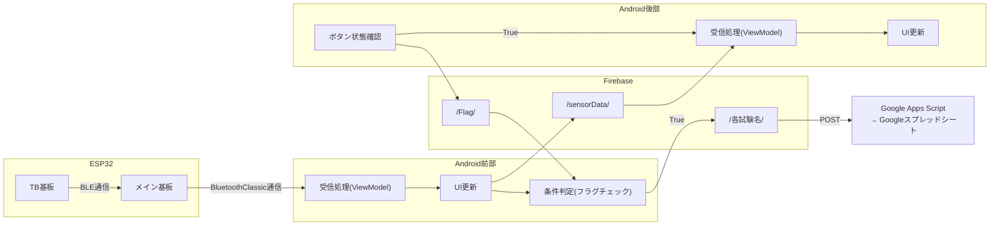

# 📡 データ連携：Android アプリのデータフローと Firebase 連携

本章では、前後パイロット間のデータ共有およびクラウド連携の仕組みについて解説する。  
ESP32 → Android → Firebase → Google Apps Script（スプレッドシート）へと至る一連のデータフローを示し、各層の役割とデータ整合性の確保手法について述べる。

## 🧭 1. 全体概要

本システムのデータ連携は以下の 4 層構成で設計されている。

| 層         | 主な要素                       | 役割                               |
| ---------- | ------------------------------ | ---------------------------------- |
| デバイス層 | ESP32（TB 基板・メイン基板）   | 各種センサー値の収集・統合         |
| 通信層     | Bluetooth Classic / BLE        | デバイス間・Android 間のデータ転送 |
| アプリ層   | Android (前・後部パイロット用) | データの処理・保存・送信制御       |
| クラウド層 | Firebase / Google Apps Script  | データの共有・ログ保存・可視化     |

デバイス層は、ESP32 によって制御されている。  
高度、機速、姿勢角を I²C 通信、舵角をシリアル通信にて取得する。  
TB 基板-メイン基板間を BLE 通信にてデータを集約後、メイン基板-Android 間を Bluetooth Classic 通信にてデータ共有する。  
デバイスについての詳細は[ハードウェア設計・実装構成](./docs/hardware_spec.md)参照。

アプリ層には、2 台の Android がある。
前部パイロットアプリが ESP32 との通信とクラウド層へのデータ保存を担当、後部パイロットアプリがデータ保存のフラグ管理を担当する。

---

# 🔄 2. データフロー全体図



上図では、ESP32 で取得したセンサデータが Android アプリを介して Firebase に送信され、条件フラグが True の場合に Google Apps Script へ転送される一連の流れを示している。  
これにより、試験データはリアルタイムでクラウド保存・共有される。  
このような

## 💾 3. Firebase Realtime Database 構成

Firebase では以下のディレクトリを定義している。
| ディレクトリ名 | データ内容 | 更新タイミング | 備考 |
| -------------- | -------------- | -------- | ---------- |
| `/sensorData/` | 最新センサ値（Map） | 常時 | 最大 20 件まで |
| `/Flag/` | Boolean 値 | 常時 | ボタン状態制御 |
| `/Flight/` | 試験名＋フライト数（文字列） | 常時 | ディレクトリ名生成用 |
| `/各試験名/` | 記録データ（Map） | フラグ True 時 | 保存データ本体 |

`/sensorData/` ディレクトリには、前部パイロットアプリの UI 更新ごとに最新データを保存している。  
Firebase の負荷を軽減するため、このディレクトリ内のデータ数は最大 20 件に制限している。

`/Flag/` ディレクトリは、後部パイロットアプリのボタン状態を保持する。  
このディレクトリは最新 1 件のみを維持し、後部アプリの起動中は常に状態が更新される。  
更新が 3 秒以上途絶えた場合、前部アプリが自動的に `False` を書き込み、保存を停止する仕組みとした。  
これにより、通信断などで「`True`」のまま動作が継続することを防いでいる。  
Firebase の負荷を軽減するため、このディレクトリ内のデータ数は毎回上書きしている。

`/Flight/` ディレクトリは、試験名とフライト数を保持し、前部アプリが最終保存時にディレクトリ名として利用する。  
後部パイロットのスマホでフライト名と本数を選択後、`/Flag/`の後に更新する。  
直接的な動作には関与しないため、データフロー図からは省略した。

`/各試験名/` ディレクトリ（例：1stTF/1 本目/）には、実際の保存データを格納する。  
このディレクトリ名は、Flight ディレクトリで指定された試験名・フライト数をもとに前部アプリが生成する。

# 📈 4. データ流れの時系列例

前部パイロットアプリ

| 時刻      | イベント       | 処理内容                      |
| --------- | -------------- | ----------------------------- |
| 00:00.000 | ESP32 送信開始 | TB → メイン基板（BLE）        |
| 00:00.200 | Android 受信   | `updateLatestData()` 呼び出し |
| 00:00.220 | Firebase 更新  | `/sensorData/` に保存         |
| 00:00.300 | フラグ ON 検知 | `/各試験名/` & GAS へ転送     |

後部パイロットアプリ

| 時刻      | イベント       | 処理内容                              |
| --------- | -------------- | ------------------------------------- |
| 00:00.000 | ボタン ON 検知 | viewmodel の更新                      |
| 00:00.020 | Firebase 更新  | `/Flag/` に保存                       |
| 00:00.040 | Firebase 受信  | `/sensorData/`最新データを取得        |
| 00:00.100 | 後部アプリ更新 | `/sensorData/` リスナーによる UI 更新 |

<!--言葉での説明もあったほうがいい？-->

# 🔐 5. セキュリティ設計

| 項目                   | 実装内容                                         |
| ---------------------- | ------------------------------------------------ |
| Firebase 認証          | メールアドレス＋パスワード認証                   |
| 読み書きルール         | 認証済ユーザーのみ許可                           |
| 認証メールアドレス追加 | Firebase Functions による自動認証                |
| GAS 連携               | HTTPS POST（認証トークン付与）                   |
| 個人情報保護           | 実測データのみを保存し、端末識別情報は送信しない |

Firebase RealtimeDatabase では、認証済みユーザーのみが読み書き可能となるよう、以下のルールを設定している。  
また、時系列データ処理を高速化するため、`/sensorData/` パスに対して `timestamp` フィールドをインデックス指定している。

```json
{
  "rules": {
    ".read": "auth != null",
    ".write": "auth != null",
    "sensorData": {
      ".read": "auth != null",
      ".write": "auth != null",
      ".indexOn": "timestamp"
    }
  }
}
```

これにより、時刻順でのデータ取得が効率化され、タイムステップごとの描画や解析がスムーズになる。
本構成により、リアルタイム性とデータ信頼性を両立しつつ、クラウド上での可視化・共有を可能としている。
