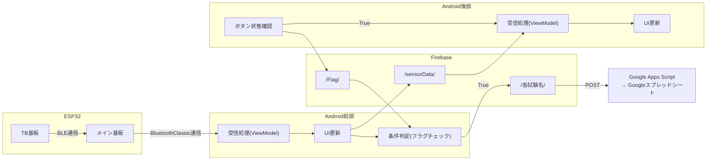

# 📡 データ連携：AndroidアプリのデータフローとFirebase連携

本章では、前後パイロット間のデータ共有およびクラウド連携の仕組みについて解説する。  
ESP32 → Android → Firebase → Google Apps Script（スプレッドシート）へと至る一連のデータフローを示し、各層の役割とデータ整合性の確保手法について述べる。

---

# 🧭 1. 全体概要

本システムのデータ連携は以下の4層構成で設計されている。

| 層 | 主な要素 | 役割 |
|----|-----------|------|
| デバイス層 | ESP32（TB基板・メイン基板） | 各種センサー値の収集・統合 |
| 通信層 | Bluetooth Classic / BLE | デバイス間・Android間のデータ転送 |
| アプリ層 | Android (前・後部パイロット用) | データの処理・保存・送信制御 |
| クラウド層 | Firebase / Google Apps Script | データの共有・ログ保存・可視化 |

---

# 🔄 2. データフロー全体図



# 💾 3. Firebase Realtime Database 構成

Firebaseでは以下のディレクトリを定義している。
| ディレクトリ名        | データ内容          | 更新タイミング  | 備考         |
| -------------- | -------------- | -------- | ---------- |
| `/sensorData/` | 最新センサ値（Map）    | 常時       | 最大20件まで    |
| `/Flag/`       | Boolean値       | 常時       | ボタン状態制御    |
| `/Flight/`     | 試験名＋フライト数（文字列） | 常時       | ディレクトリ名生成用 |
| `/各試験名/`       | 記録データ（Map）      | フラグTrue時 | 保存データ本体    |


`/sensorData/` ディレクトリには、前部パイロットアプリのUI更新ごとに最新データを保存している。
Firebaseの負荷を軽減するため、このディレクトリ内のデータ数は最大20件に制限している。

`/Flag/` ディレクトリは、後部パイロットアプリのボタン状態を保持する。
このディレクトリは最新1件のみを維持し、後部アプリの起動中は常に状態が更新される。
更新が3秒以上途絶えた場合、前部アプリが自動的に `False` を書き込み、保存を停止する仕組みとした。
これにより、通信断などで「`True`」のまま動作が継続することを防いでいる。

`/Flight/` ディレクトリは、試験名とフライト数を保持し、前部アプリが最終保存時にディレクトリ名として利用する。
直接的な動作には関与しないため、データフロー図からは省略している。

`/各試験名/` ディレクトリ（例：1stTF/1本目/）には、実際の保存データを格納する。
このディレクトリ名は、Flight ディレクトリで指定された試験名・フライト数をもとに前部アプリが生成する。


# 📈 4. データ流れの時系列例

| 時刻        | イベント       | 処理内容                       |
| --------- | ---------- | -------------------------- |
| 00:00.000 | ESP32送信開始  | TB → メイン基板（BLE）            |
| 00:00.200 | Android受信  | `updateLatestData()` 呼び出し |
| 00:00.220 | Firebase更新 | `/sensorData/` に保存            |
| 00:00.300 | フラグON検知    | `/各試験名/` & GAS へ転送        |
| 00:00.300 | 後部アプリ更新    | `/sensorData/` リスナーによるUI更新       |


# 🔐 5. セキュリティ設計

| 項目          | 実装内容                      |
| ----------- | ------------------------- |
| Firebase認証  | メールアドレス＋パスワード認証           |
| 読み書きルール     | 認証済ユーザーのみ許可               |
| 認証メールアドレス追加 | Firebase Functionsによる自動認証 |
| GAS連携       | HTTPS POST（認証トークン付与）      |
| 個人情報保護      | 実測データのみを保存し、端末識別情報は送信しない  |

Firebase RealtimeDatabase では、認証済みユーザーのみが読み書き可能となるよう、以下のルールを設定している。  
また、時系列データ処理を高速化するため、`/sensorData/` パスに対して `timestamp` フィールドをインデックス指定している。

```json
{
  "rules": {
    ".read": "auth != null",
    ".write": "auth != null",
    "sensorData": {
      ".read": "auth != null",
      ".write": "auth != null",
      ".indexOn": "timestamp"
    }
  }
}
```
これにより、時刻順でのデータ取得が効率化され、タイムステップごとの描画や解析がスムーズになる。
本構成により、リアルタイム性とデータ信頼性を両立しつつ、クラウド上での可視化・共有を可能としている。
