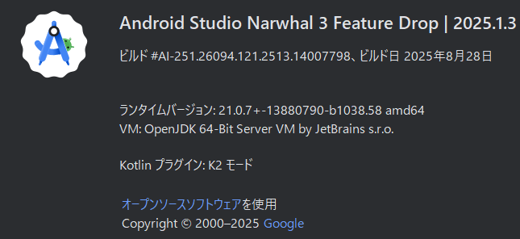

# 🛠️ 開発ガイド

本章では、S310 フライトデータ計測システムの開発・運用に関する手順とルールをまとめる。  
ファームウェア、Android アプリ、Firebase 連携、そしてリポジトリ運用ルールを包括的に扱う。

## 📄 目次

- [🛠️ 開発ガイド](#️-開発ガイド)
  - [📄 目次](#-目次)
  - [1. 📦 環境構築](#1--環境構築)
    - [ファームウェア開発環境](#ファームウェア開発環境)
    - [Android アプリ開発環境](#android-アプリ開発環境)
    - [1.2 初期設定と環境準備](#12-初期設定と環境準備)
      - [1. 前提となる環境の確認と準備 (Node.js)](#1-前提となる環境の確認と準備-nodejs)
    - [1. リポジトリのクローン (`git clone`) の実行](#1-リポジトリのクローン-gitclone-の実行)
    - [2. Git コマンドが失敗する場合の対処法](#2-git-コマンドが失敗する場合の対処法)
    - [対処法 A: Git のインストール](#対処法-a-git-のインストール)
    - [対処法 B: 環境変数の設定（最も重要）](#対処法-b-環境変数の設定最も重要)
  - [2. ファームウェア開発（Firmware）](#2-ファームウェア開発firmware)
    - [2.1 概要](#21-概要)
    - [2.2 ビルド・書き込み](#22-ビルド書き込み)
    - [2.3 注意点](#23-注意点)
  - [3. Android アプリ開発（App）](#3-android-アプリ開発app)
    - [3.1 概要](#31-概要)
    - [3.2 ビルド手順](#32-ビルド手順)
  - [5.2 コード・ブランチ運用（重要・必見）](#52-コードブランチ運用重要必見)
  - [🪶 feature ブランチ作成から Pull Request までの流れ](#-feature-ブランチ作成から-pull-request-までの流れ)
  - [5.3 コーディング規約](#53-コーディング規約)

## 1. 📦 環境構築

### ファームウェア開発環境

- **マイコン**：ESP32（ESP32-WROOM-32 または同等品）
- **使用ツール**
  - Arduino IDE
  - 必要なライブラリは `/firmware/lib_deps.txt`(追記予定) を参照
- **ボード設定例**
  - ボード名：`ESP32 Dev Module`
  - Upload Speed：`921600`
  - Flash Frequency：`80MHz`

### Android アプリ開発環境

- **開発言語**：Kotlin
- **IDE**：Android Studio
- **主要ライブラリ**
  - Firebase（Realtime Database / Authentication）
  - Bluetooth API
  - ViewModel + LiveData（MVVM(Model-View-ViewModel) 構成）

### 1.2 初期設定と環境準備

#### 1. 前提となる環境の確認と準備 (Node.js)

このプロジェクトを実行するには、サーバーサイド JavaScript の実行環境である **Node.js** が必須です。

(1) インストールと環境変数  
インストール: [Node.js 公式サイト](https://nodejs.org/) から推奨版をダウンロードし、インストールしてください。

環境変数 (PATH): Node.js のインストーラーは、インストール時に自動で実行ファイル（node.exe や npm など）へのパスを Windows の環境変数 PATH に追加します。

(2) インストールの確認  
インストール後、以下のコマンドを実行し、バージョンが表示されるかを確認してください。

| 確認事項       | コマンド | 正常な結果の例                      |
| -------------- | -------- | ----------------------------------- |
| Node.js の有無 | node -v  | v22.20.0 などバージョンが表示される |
| npm の有無     | npm -v   | 10.9.3 などバージョンが表示される   |

| 実行例                                                                  |
| ----------------------------------------------------------------------- |
|  |

(3) 環境変数が有効にならない場合の対処法  
上記コマンドがエラーになる場合、PowerShell を一度閉じ、新しく開き直すことで解決することが多いです。

それでも解決しない場合は、手動で `PATH` に追加します。PowerShell を**管理者として実行**し、以下のコマンドを実行してください。

```bash
# Node.jsのインストールパスを代入（通常はここ）
$NodePath = "C:\Program Files\nodejs"

# 既存のPathにNodePathを追加し、システム環境変数としてPathを更新
$NewPath = [Environment]::GetEnvironmentVariable("Path", "Machine") + ";" + $NodePath
[Environment]::SetEnvironmentVariable("Path", $NewPath, "Machine")
```

コマンド実行後、必ず PowerShell を**再起動**してください。

### 1. リポジトリのクローン (`git clone`) の実行

PowerShell などのターミナルを開き、プロジェクトを配置したいディレクトリに移動してから、以下のコマンドを実行します。

1. コマンドの実行  
   PowerShell などのターミナルを開き、目的のディレクトリ（ファイルを作成したい場所）に移動してから、以下のコマンドを実行します。

```bash
git clone https://github.com/tbt-densou/S310-app-open.git
```

| 実行例                                                                           |
| -------------------------------------------------------------------------------- |
|  |

※実行例は他のレポジトリをクローンしています

1. 実行結果  
   コマンドが成功すると、以下のようになります。

- コマンドを実行したディレクトリ（例: `C:\Users\norah`）に、リポジトリ名と同じ`S310-app-open`という新しいフォルダが作成されます。

| 例                                                                                  |
| ----------------------------------------------------------------------------------- |
|  |

- そのフォルダ内に、GitHub リポジトリ内のすべてのファイルと、Git のバージョン管理に必要な隠しファイル（`.git`フォルダ）が**すべてコピー**されます。

### 2. Git コマンドが失敗する場合の対処法

`git clone`や他の`git`コマンドを実行した際に、「`git`は、内部コマンドまたは外部コマンド、操作可能なプログラムまたはバッチファイルとして認識されていません。」といったエラーが出る場合、Git が正しくセットアップできていない可能性があります。

### 対処法 A: Git のインストール

コマンドが失敗する最も一般的な原因は、Git 本体がダウンロードされていないことです。

- [Git 公式サイト](https://git-scm.com/) より、ご自身の OS に合った Git をダウンロードし、インストールしてください。

### 対処法 B: 環境変数の設定（最も重要）

インストール後もコマンドが使えない場合は、Windows の**環境変数 PATH**が原因です。

【ポイント】  
Git をインストールする際、セットアップウィザードで「_Adjusting your PATH environment_」（PATH 環境の調整）という項目が表示されます。ここで「_Git from the command line and also from 3rd-party software_」（コマンドラインとサードパーティソフトウェアから Git を使用する）を選択しないと、PowerShell などのターミナルから`git`という名前でコマンドを実行できません。

【対処法】  
1.PowerShell の再起動:  
インストールまたは設定変更後、現在開いている PowerShell のウィンドウには新しい設定が反映されません。一度 PowerShell をすべて閉じ、新しく開き直すことで、`git`コマンドが使えるようになることがほとんどです。

2.手動での PATH 設定:  
再起動しても解決しない場合、手動で PATH に追加します。PowerShell を**管理者として実行**し、以下のコマンドを実行してください。

```bash
# Gitのパスを代入（インストール先に合わせる）
$GitPath = "C:\Program Files\Git\cmd"

# 既存のPathにGitPathを追加し、システム環境変数としてPathを更新
$NewPath = [Environment]::GetEnvironmentVariable("Path", "Machine") + ";" + $GitPath
[Environment]::SetEnvironmentVariable("Path", $NewPath, "Machine")
```

コマンド実行後、必ず PowerShell を**再起動**してください。

---

AndroidStudio の初期設定：  
使用バージョンは以下のとおりである。



地図の使用をする際は、 [norahshion](https://github.com/norahshion)に API キーを確認後、`local.properties`に以下のように追記すること。

```kotlin
MAPS_API_KEY = 確認したAPIキー
```

---

Arduino IDE の初期設定：  
Arduino IDE にて初めて ESP32 を使用する場合と、ESP32 の MAC アドレスが不明な場合は、[ESP32 についての資料](https://drive.google.com/file/d/1ZY2SXC2UxHYAWeiazQs4ZZ5E55frYKhl/view?usp=drive_link)を参考に、初期設定および MAC アドレスを調べてください。
`/firmware/lib_deps.txt`(追記予定)を参考に、必要ライブラリをインストールしてください。

---

VisualStudioCode の初期設定(markdown 記述に使う場合のみ)：  
以下拡張機能をインストールすることを推奨。

- [Markdown All in One](https://marketplace.visualstudio.com/items?itemName=yzhang.markdown-all-in-one)
  - markdown のショートカット、整形
- [markdownlint](https://marketplace.visualstudio.com/items?itemName=DavidAnson.vscode-markdownlint)
  - markdown の構文チェック
- [Prettier - Code formatter](https://marketplace.visualstudio.com/items?itemName=esbenp.prettier-vscode)
  - コード整形
- [Paste Image](https://marketplace.visualstudio.com/items?itemName=mushan.vscode-paste-image)
  - スクリーンショットした画像を`Ctrl + Alt + v`で貼り付け&images パスに配置
- [Git Graph](https://marketplace.visualstudio.com/items?itemName=mhutchie.git-graph)
  - コミット履歴の流れの確認
- [Git History](https://marketplace.visualstudio.com/items?itemName=donjayamanne.githistory)
  - ファイル履歴や差分の確認
- [GitHub Copilot](https://marketplace.visualstudio.com/items?itemName=GitHub.copilot)
- [GitHub Copilot Chat](https://marketplace.visualstudio.com/items?itemName=GitHub.copilot-chat)
  - エディタ内で GitHub Copilot 使用可能
- [GitHub Pull Requests](https://marketplace.visualstudio.com/items?itemName=GitHub.vscode-pull-request-github)
  - エディタ内で Pull Request 作成可能
- [GitLens — Git supercharged](https://marketplace.visualstudio.com/items?itemName=eamodio.gitlens)
  - Git 機能の強化
- [Markdown Preview Mermaid Support](https://marketplace.visualstudio.com/items?itemName=bierner.markdown-mermaid)
  - Mermaid 記法で記述した図を確認可能
- [zenkaku](https://marketplace.visualstudio.com/items?itemName=mosapride.zenkaku)
  - 全角スペースの検出
- [Trailing Spaces](https://marketplace.visualstudio.com/items?itemName=shardulm94.trailing-spaces)
  - 行末の不要な空白を自動削除することで、Git の不要な差分を減らす

それぞれの使用方法については、[拡張機能仕様例](./docs/vscode-guide.md)を参照してください。

## 2. ファームウェア開発（Firmware）

### 2.1 概要

ESP32 を用いた計測機器制御用のプログラム群。I²C センサデータ取得、Bluetooth 通信、シリアルデバッグを主とする。

### 2.2 ビルド・書き込み

Arduino IDE で開く → ボード設定：ESP32 Dev Module

書き込み：Ctrl + U または Upload ボタン

シリアルモニタ（115200bps）でログ確認

### 2.3 注意点

センサ接続確認後に給電すること

Bluetooth 名・ペアリング設定を適宜変更

## 3. Android アプリ開発（App）

### 3.1 概要

Bluetooth 経由で ESP32 からデータ受信し、Firebase に送信するクライアントアプリ。
主要モジュール：

screens/：表示関連（Compose）

navigation/：画面遷移(NavigationGraph)

model/：Bluetooth 通信処理

viewmodel/：状態管理

### 3.2 ビルド手順

Android Studio でプロジェクトを開く

デバッグ実行または APK ビルド

## 5.2 コード・ブランチ運用（重要・必見）

**_🚫 main ブランチへの直接 push 禁止_**

---

🔧 ブランチ作成方法

```nginx
git switch -c ブランチ名
例：git switch -c feature/dev-guide-summary
```

作成ルール  
`feature/変更内容を簡潔に示す名前`で作成すること

---

🔄 ブランチ切り替え方法

```nginx
git switch -c ブランチ名
例：git switch -c feature/dev-guide-summary
```

## 🪶 feature ブランチ作成から Pull Request までの流れ

| コマンド                                                       | 説明                                                                                                         |
| -------------------------------------------------------------- | ------------------------------------------------------------------------------------------------------------ |
| `cd s310-app-open`                                             | クローンしたプロジェクトのディレクトリに移動<br>例：`PS C:\Users\norah\s310-app-open>` と表示されていれば OK |
| `git status`                                                   | 変更・追加されたファイルを確認（不要な変更があれば roll back）                                               |
| `git add .`                                                    | 変更したファイルをステージに追加                                                                             |
| `git commit -m "簡潔な変更点" -m "詳細な説明（必要に応じて）"` | 変更内容を明確に記述する（例：「README の構成を更新」など）                                                  |
| `git push origin feature/ブランチ名`                           | 作成したブランチに変更を反映（リモートへプッシュ）                                                           |

この操作のあと、GitHub 上で Pull Request（PR）を作成できる。  
PR 作成後は、[norahshion](https://github.com/norahshion)の確認後に main ブランチへマージを行う。

---

⚠️ push 時にエラーが出た場合

GitHub 上のリモートリポジトリが更新されていると、push 時にエラーが発生することがある。
その場合は以下のコマンドでリモートの変更を取り込む：

```nginx
git pull origin ブランチ名
```

これによりリモートの最新状態を自分のローカルに反映し、再度 push できるようになる。

## 5.3 コーディング規約

🔹 インデント・フォーマット

- インデントは スペース 2 個 に統一する

- 不要な空行・末尾スペースは削除する

- 保存時に自動整形を行うため、以下の拡張機能の導入を推奨する

  - Prettier（全言語共通の整形ルール適用）

  - ktlint（Kotlin コードの整形チェック）

- .vscode/settings.json に設定済み  
  インストールしていない場合でもエラーにはならないが、フォーマット差分が出やすくなるため注意。

- インデント統一（スペース 2）

---

🔹 命名規則

- 英語ベースで記述し、略語は避ける

- 変数・関数・ファイル名は、内容が明確にわかる名前にする

  ✅ flightDataLogger

  ❌ fdl, tmp, test1

🧩 各スタイルの使い分け

| スタイル           | 例                    | 用途          | 説明                         |
| -------------- | -------------------- | ----------- | -------------------------- |
| **camelCase**  | `flightDataLogger`   | 変数名・関数名     | 先頭小文字。単語の区切りを大文字で表す。       |
| **PascalCase** | `FlightDataLogger`   | クラス名・構造体名   | 先頭大文字。各単語の先頭も大文字にする。       |
| **kebab-case** | `flight-data-logger` | ブランチ名・ファイル名 | 単語をハイフンで区切る。Git運用やURLに適する。 |
| **SNAKE_CASE** | `MAX_ALTITUDE`       | 定数名         | 全て大文字＋アンダースコア区切り。          |

🪶 ブランチ命名ルール

feature/変更内容を簡潔に示す名前
例：feature/update-readme、feature/add-sensor-logger

ブランチ名・Markdownファイル名は ケバブケース に統一する

---

🔹 コメント方針

「何をしているか」ではなく、「なぜそうしたか」を重点的に記述する

特殊な処理・回避策・一時対応などは理由を明記する

不明点・改善予定箇所には以下を明示する

```html
<!-- TODO: データ取得間隔の最適化を検討 -->
<!-- FIXME: 初回接続時の遅延を要調査 -->
```

コメントは処理意図・判断理由を残すことを目的とする。
コード自体で意図が明確な場合は不要なコメントを避ける。

---

🔹 ファイル構成・その他

各ファイルは 1 つの目的・機能に限定して構成する

共通処理・定数は 共通モジュール（util・commonなど） にまとめる

不要になったコードはコメントアウトではなく削除する（Git で履歴を追えるため）

ファイル名は機能を明確に示す英語名を用いる

---

🔹 運用上の補足

VSCode環境では .vscode/settings.json により自動整形が適用される

他のエディタを使用する場合は、Prettier / ktlint の設定を手動で合わせること

整形前後でフォーマット差分が発生した場合、必ずコミット前に確認すること

---

💬 備考

本規約は、以下を目的として運用される。

- チーム全体でのコードスタイル統一
- コードレビュー効率の向上
- 不要な差分・競合の削減
- 将来の保守性・可読性の確保
