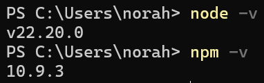
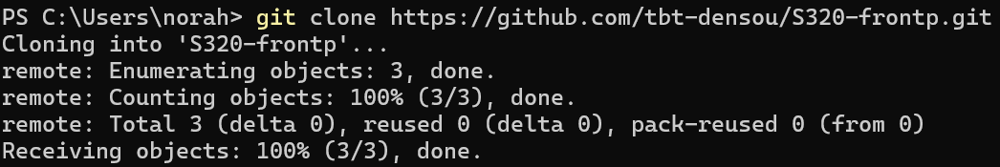
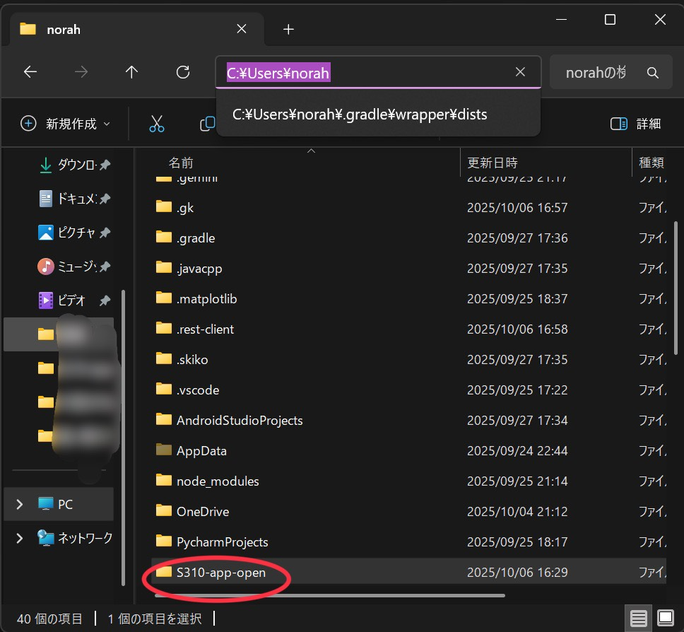

# 🛠️ 開発ガイド

本章では、S310 フライトデータ計測システムの開発・運用に関する手順とルールをまとめる。  
ファームウェア、Androidアプリ、Firebase連携、そしてリポジトリ運用ルールを包括的に扱う。

**概要のみ記述、のちに修正**

## 📄 目次

- [1.環境構築](#1-📦-環境構築)
    - [1.1 必要ツール](#11-必要ツール)
    - [1.2 環境構築](#12-初期設定)

## 1. 📦 環境構築

### ファームウェア開発環境

- **マイコン**：ESP32（ESP32-WROOM-32 または同等品）
- **使用ツール**
  - Arduino IDE
  - 必要なライブラリは `/firmware/lib_deps.txt`(追記予定) を参照
- **ボード設定例**
  - ボード名：`ESP32 Dev Module`
  - Upload Speed：`921600`
  - Flash Frequency：`80MHz`

### Androidアプリ開発環境

- **開発言語**：Kotlin
- **IDE**：Android Studio
- **主要ライブラリ**
  - Firebase（Realtime Database / Authentication）
  - Bluetooth API
  - ViewModel + LiveData（MVVM構成）

### 1.2 初期設定と環境準備

#### 1. 前提となる環境の確認と準備 (Node.js)

このプロジェクトを実行するには、サーバーサイドJavaScriptの実行環境である **Node.js** が必須です。

(1) インストールと環境変数  
インストール: Node.js公式サイト (https://nodejs.org/) から推奨版をダウンロードし、インストールしてください。

環境変数 (PATH): Node.jsのインストーラーは、インストール時に自動で実行ファイル（node.exeやnpmなど）へのパスをWindowsの環境変数 PATH に追加します。

(2) インストールの確認  
インストール後、以下のコマンドを実行し、バージョンが表示されるかを確認してください。

|確認事項	|コマンド	|正常な結果の例|
|---|---|---|
|Node.jsの有無	|node -v	|v22.20.0 などバージョンが表示される|
|npmの有無	|npm -v	|10.9.3 などバージョンが表示される|

|実行例|
|---|
||

(3) 環境変数が有効にならない場合の対処法  
上記コマンドがエラーになる場合、PowerShellを一度閉じ、新しく開き直すことで解決することが多いです。

それでも解決しない場合は、手動で `PATH` に追加します。PowerShellを**管理者として実行**し、以下のコマンドを実行してください。

```bash
# Node.jsのインストールパスを代入（通常はここ）
$NodePath = "C:\Program Files\nodejs"

# 既存のPathにNodePathを追加し、システム環境変数としてPathを更新
$NewPath = [Environment]::GetEnvironmentVariable("Path", "Machine") + ";" + $NodePath
[Environment]::SetEnvironmentVariable("Path", $NewPath, "Machine")
```
コマンド実行後、必ずPowerShellを**再起動**してください。

### 1. リポジトリのクローン (`git clone`) の実行
PowerShellなどのターミナルを開き、プロジェクトを配置したいディレクトリに移動してから、以下のコマンドを実行します。

1. コマンドの実行  
PowerShellなどのターミナルを開き、目的のディレクトリ（ファイルを作成したい場所）に移動してから、以下のコマンドを実行します。

```bash
git clone https://github.com/tbt-densou/S310-app-open.git
```
|実行例|
|---|
||

※実行例は他のレポジトリをクローンしています


1. 実行結果  
コマンドが成功すると、以下のようになります。

- コマンドを実行したディレクトリ（例: `C:\Users\norah`）に、リポジトリ名と同じ`S310-app-open`という新しいフォルダが作成されます。

|例|
|---|
||

- そのフォルダ内に、GitHubリポジトリ内のすべてのファイルと、Gitのバージョン管理に必要な隠しファイル（`.git`フォルダ）が**すべてコピー**されます。

### 2. Gitコマンドが失敗する場合の対処法

`git clone`や他の`git`コマンドを実行した際に、「`git`は、内部コマンドまたは外部コマンド、操作可能なプログラムまたはバッチファイルとして認識されていません。」といったエラーが出る場合、Gitが正しくセットアップできていない可能性があります。

### 対処法 A: Gitのインストール
コマンドが失敗する最も一般的な原因は、Git本体がダウンロードされていないことです。

- Git公式サイト (https://git-scm.com/) より、ご自身のOSに合ったGitをダウンロードし、インストールしてください。

### 対処法 B: 環境変数の設定（最も重要）
インストール後もコマンドが使えない場合は、Windowsの**環境変数 PATH**が原因です。

【ポイント】  
Gitをインストールする際、セットアップウィザードで「Adjusting your PATH environment」（PATH 環境の調整）という項目が表示されます。ここで「Git from the command line and also from 3rd-party software」（コマンドラインとサードパーティソフトウェアからGitを使用する）を選択しないと、PowerShellなどのターミナルから`git`という名前でコマンドを実行できません。

【対処法】  
1.PowerShellの再起動:  
インストールまたは設定変更後、現在開いているPowerShellのウィンドウには新しい設定が反映されません。一度PowerShellをすべて閉じ、新しく開き直すことで、`git`コマンドが使えるようになることがほとんどです。

2.手動での PATH 設定:  
再起動しても解決しない場合は、手動でGitの実行ファイル（通常は `C:\Program Files\Git\cmd`）の場所を**システム環境変数 PATH** に追加し、再度PowerShellを再起動してください。


---
AndroidStudioの初期設定：  
使用バージョンは以下のとおりである。
```
Android Studio Narwhal 3 Feature Drop | 2025.1.3
Build #AI-251.26094.121.2513.14007798, built on August 28, 2025
Runtime version: 21.0.7+-13880790-b1038.58 amd64
VM: OpenJDK 64-Bit Server VM by JetBrains s.r.o.
Toolkit: sun.awt.windows.WToolkit
Windows 11.0
Kotlin プラグイン: K2 モード
GC: G1 Young Generation, G1 Concurrent GC, G1 Old Generation
Memory: 2048M
Cores: 16
Registry:
  ide.experimental.ui=true
Non-Bundled Plugins:
  com.intellij.ja (251.26094.121)
  Dart (251.27623.5)
  io.flutter (87.1)
```

地図の使用をする際は、 [norahshion](https://github.com/norahshion)にAPIキーを確認後、`local.properties`に以下のように追記すること。
```kotlin
MAPS_API_KEY = 確認したAPIキー
```

---
Arduino IDEの初期設定：  

---

VisualStudioCodeの初期設定(markdown記述に使う場合のみ)：  
以下拡張機能をインストールすることを推奨。
- [Markdown All in One](https://marketplace.visualstudio.com/items?itemName=yzhang.markdown-all-in-one)
  - markdownのショートカット、整形
- [markdownlint](https://marketplace.visualstudio.com/items?itemName=DavidAnson.vscode-markdownlint)
  - markdownの構文チェック
- [Prettier - Code formatter](https://marketplace.visualstudio.com/items?itemName=esbenp.prettier-vscode)
  - コード整形
- [Paste Image](https://marketplace.visualstudio.com/items?itemName=mushan.vscode-paste-image)
  - スクリーンショットした画像を`Ctrl + Alt + v`で貼り付け&imagesパスに配置
- [Git Graph](https://marketplace.visualstudio.com/items?itemName=mhutchie.git-graph)
  - コミット履歴の流れの確認
- [Git History](https://marketplace.visualstudio.com/items?itemName=donjayamanne.githistory)
  - ファイル履歴や差分の確認
- [GitHub Copilot](https://marketplace.visualstudio.com/items?itemName=GitHub.copilot)
- [GitHub Copilot Chat](https://marketplace.visualstudio.com/items?itemName=GitHub.copilot-chat)
  - エディタ内でGitHub Copilot使用可能
- [GitHub Pull Requests](https://marketplace.visualstudio.com/items?itemName=GitHub.vscode-pull-request-github)
  - エディタ内でPull Request作成可能
- [GitLens — Git supercharged](https://marketplace.visualstudio.com/items?itemName=eamodio.gitlens)
  - Git機能の強化
- [Markdown Preview Mermaid Support](https://marketplace.visualstudio.com/items?itemName=bierner.markdown-mermaid)
  - Mermaid記法で記述した図を確認可能
- [zenkaku](https://marketplace.visualstudio.com/items?itemName=mosapride.zenkaku)
  - 全角スペースの検出
- [Trailing Spaces](https://marketplace.visualstudio.com/items?itemName=shardulm94.trailing-spaces)
  - 行末の不要な空白を自動削除することで、Gitの不要な差分を減らす


## 2. ファームウェア開発（Firmware）
### 2.1 概要

ESP32を用いた計測機器制御用のプログラム群。I²Cセンサデータ取得、Bluetooth通信、シリアルデバッグを主とする。

### 2.2 ビルド・書き込み

Arduino IDEで開く → ボード設定：ESP32 Dev Module

書き込み：Ctrl + U または Upload ボタン

シリアルモニタ（115200bps）でログ確認

### 2.3 注意点

センサ接続確認後に給電すること

Bluetooth名・ペアリング設定を適宜変更

## 3. Androidアプリ開発（App）
### 3.1 概要

Bluetooth経由でESP32からデータ受信し、Firebaseに送信するクライアントアプリ。
主要モジュール：

ui/：表示関連（Compose）

data/：Firebase・Bluetooth入出力

viewmodel/：状態管理

### 3.2 ビルド手順

Android Studioでプロジェクトを開く

Firebase接続設定を確認（google-services.json）

デバッグ実行またはAPKビルド

## 5.2 コード・ブランチ運用（重要・必見）

***mainブランチへの直接push禁止***

ブランチ作成方法
```
git switch -c ブランチ名
例：git switch -c feature/dev-guide-summary
```
作成ルール  
`feature/変更した部分が分かる名前`で作成すること  

ブランチ切り替え方法
```
git switch 切り替え前のブランチ名 切り替え後のブランチ名
例：git switch feature/dev-guide-summary feature/readme-summary
```

featureブランチを作成 → Pull Request
---
PR作成までの流れ
|コマンド名|詳細|
|---|---|
|cd s310-app-open|クローンしたファイルに移動、PS C:\Users\norah\s310-app-open>のようになっていればok|
|git stats|必要ないファイルが含まれていないか確認、必要ないものはroll back|
|git add .|アップロードするファイルの追加|
|git commit -m "簡潔な変更点"|変更点の見出し、一目で変更点が分かるよう書くこと|
|git push origin feature/作成したブランチ|ブランチに変更を適応する|

この操作の後にGitHubでPull Request作成ができる  
Pull Request作成後は[norahshion](https://github.com/norahshion)に確認後mainにマージ

※push時にGitHub上のコードが変更されていたらエラーになる
```
git pull origin ブランチ名
```
このコマンドを実行すればGitHub上の変更を自分のパソコンに取り込むことができ、プッシュできるようになる

## 5.3 コーディング規約

インデント統一（スペース2）

命名規則：英語ベース・略語を避ける

コメント：処理理由を明示（「なぜそうしたか」）

編集途中のものや改善の余地があるものには必ず`<!--TODO-->` にて詳細を記載すること

## 7. 付録（Appendix）

開発メンバー連絡先（GitHubハンドル）

バージョン履歴

関連リポジトリ・資料リンク


---

### 📘 運用方法
